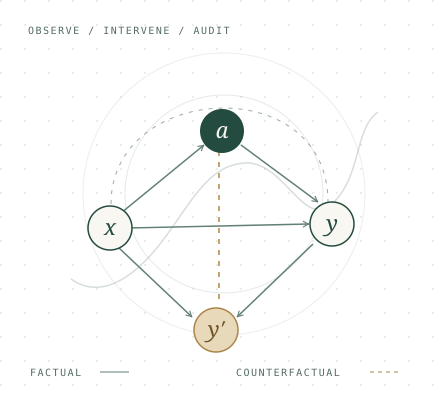

:::: {.hero}
::: {.hero-copy}
[APPLIED MATHEMATICS · MACHINE LEARNING]{.eyebrow}

<h1 class="hero-name">Sheng’en Li</h1>

::: {.hero-tagline}
Reliable learning.<br>Grounded in mathematics.
:::

I’m an undergraduate in the dual-degree program at **Duke Kunshan University and Duke University**. I study how machine learning systems can remain reliable, fair, and auditable as the world around them changes.

::: {.hero-actions}
[Explore my research <span aria-hidden="true">↗</span>](projects.qmd){.button-primary}
[Download CV <span aria-hidden="true">↓</span>](assets/Shengen_Li_CV.pdf){.button-secondary download="Shengen_Li_CV.pdf"}
:::

::: {.hero-links}
[sl879@duke.edu](mailto:sl879@duke.edu) <span aria-hidden="true">/</span> [GitHub ↗](https://github.com/lsnnnnnnnn)
:::
:::

::: {.hero-aside}
```{=html}
<figure class="research-figure">
  
  <figcaption><span class="figure-index">01 / A RESEARCH PERSPECTIVE</span><span>From patterns<br>to trustworthy decisions.</span></figcaption>
</figure>
```
:::
::::

::: {.affiliation-strip}
<span>DUKE KUNSHAN <span class="muted">&</span> DUKE UNIVERSITY</span>
<span>B.S. Applied Mathematics <span class="muted">/</span> Expected Dec. 2026</span>
:::

:::: {.home-section}
::: {.section-heading}
::: {}
[01 / RESEARCH]{.eyebrow}

## Questions I work on
:::
[Research experience <span aria-hidden="true">↗</span>](projects.qmd){.text-link}
:::

::: {.research-grid}
::: {.research-topic}
[I.]{.topic-index}

### Counterfactual learning

How can adaptive systems make fair decisions under feedback, limited overlap, and distribution shift?

[Causal inference · Policy auditing]{.topic-tags}
:::
::: {.research-topic}
[II.]{.topic-index}

### Graph & temporal learning

How do we learn from evolving relationships and detect anomalies without hiding subgroup failures?

[Graph learning · SPD geometry]{.topic-tags}
:::
::: {.research-topic}
[III.]{.topic-index}

### Scientific ML & verification

When is a model’s structure adequate, its parameters identifiable, and its numerical behavior verifiable?

[Model auditing · Verified computation]{.topic-tags}
:::
:::
::::

:::: {.home-section}
::: {.section-heading}
::: {}
[02 / SELECTED PUBLICATIONS]{.eyebrow}

## Recent work
:::
[All publications & manuscripts <span aria-hidden="true">↗</span>](publications.qmd){.text-link}
:::

::: {.selected-paper}
::: {.paper-venue}
ICML<br>2026
:::
::: {.paper-body}
### [COPF: An Online Framework for Deployment-Stable Counterfactual Fairness in Evolving Graphs](https://openreview.net/forum?id=2Nfr4u3pK2)

[**Sheng’en Li**, Dongmian Zou]{.paper-authors}

Online counterfactual estimation, auditing, and fairness control for evolving graph recommendation.

[First author]{.status-label} [Paper <span aria-hidden="true">↗</span>](https://openreview.net/forum?id=2Nfr4u3pK2){.paper-link}
:::
:::

::: {.selected-paper}
::: {.paper-venue}
ECAI<br>2025
:::
::: {.paper-body}
### [Enhancing Fairness in Autoencoders for Node-Level Graph Anomaly Detection](https://arxiv.org/abs/2508.10785)

[Shoju Wang\*, Yuchen Song\*, **Sheng’en Li\***]{.paper-authors}

Fairness-aware graph autoencoders with a counterfactual objective based on causal interventions.

[Co-first author]{.status-label} [Paper <span aria-hidden="true">↗</span>](https://arxiv.org/abs/2508.10785){.paper-link}
:::
:::

[\* Equal contribution. See the full publication list for manuscripts in preparation and under review.]{.small-note}
::::

:::: {.home-section .currently-section}
::: {}
[03 / CURRENTLY]{.eyebrow}

## Theory meets practice.
:::
::: {.current-items}
::: {.current-item}
[RESEARCH COLLABORATION]{.eyebrow}

### Verified Taylor-model flowpipes

Developing a differentiable flowpipe engine in PyTorch with Prof. Huan Zhang’s group at the University of Illinois Urbana-Champaign.

[May 2026 – present]{.entry-meta}
:::
::: {.current-item}
[INDUSTRY]{.eyebrow}

### Quantitative Developer Intern

Building reproducible financial-data pipelines and evidence-traceable LLM-agent workflows at Shangchen Private Fund, Shanghai.

[July 2026 – present]{.entry-meta}
:::
[More about my background <span aria-hidden="true">↗</span>](about.qmd){.text-link}
:::
::::

::: {.contact-band}
::: {}
[GET IN TOUCH]{.eyebrow}

## Let’s talk research.

Counterfactual inference, reliable learning, and the questions in between.
:::
[sl879@duke.edu <span aria-hidden="true">↗</span>](mailto:sl879@duke.edu){.contact-link}
:::
